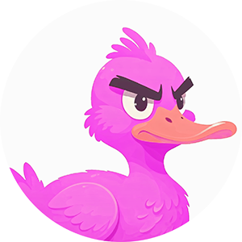

<a name="readme-top"></a>
[](README-en.md) [](README.md)  [](https://github.com/anond0rf/vecchioclient/releases) [](https://goreportcard.com/report/github.com/anond0rf/vecchioclient) [](https://github.com/anond0rf/vecchioclient) [](https://godoc.org/github.com/anond0rf/vecchioclient)
<br />
<div align="center">
  <a href="https://github.com/anond0rf/vecchioclient">
    
  </a>
<h3 align="center">VecchioClient</h3>
  <p align="center">
    <strong>VecchioClient</strong> is a Go library for posting on <a href="https://vecchiochan.com/">vecchiochan.com</a>
    <br />
    <br />
    <a href="#installation"><strong>Get Started »</strong></a>
    <br />
    <br />
    <a href="https://github.com/anond0rf/vecchioclient/blob/main/cmd/example-client/main.go">Example Code</a>
    ·
    <a href="https://github.com/anond0rf/vecchioclient/issues">Report Bug</a>
    ·
    <a href="https://github.com/anond0rf/vecchioclient/issues">Request Feature</a>
  </p>
</div>

## Features

The library wraps around the reverse-engineered `/post.php` endpoint of [NPFchan](https://github.com/fallenPineapple/NPFchan) and exposes a client that abstracts away the details of form submission and request handling.  
The following features are provided by the client:

- Post new threads to specific boards
- Reply to existing threads

Custom configuration is also possible for injecting custom `http.Client`, `User-Agent` and logger and for enabling verbose logging.  
No read functionality is provided as NPFchan already exposes the vichan  [API](https://github.com/vichan-devel/vichan-API/).

## Table of Contents

1. [Installation](#installation)
2. [Usage](#usage)
   - [Basic Client Usage](#basic-client-usage)
     - [Posting a New Thread](#posting-a-new-thread)
     - [Posting a Reply](#posting-a-reply)
   - [Custom Client Configuration](#custom-client-configuration)
3. [License](#license)

## Installation

To install VecchioClient, use `go get`:

```bash
go get github.com/anond0rf/vecchioclient
```

## Usage

### Basic Client Usage

VecchioClient offers a simple and straightforward API to interact with vecchiochan. Here's how to get started:

1. Import the client into your Go code:

    ```go
    import "github.com/anond0rf/vecchioclient/client"
    ```

2. Create a client:
   
    ```go
    vc := client.NewVecchioClient()
    ```

3. Use the client to interact with vecchiochan, such as posting a new thread or replying to an existing one.  

    - ##### Posting a New Thread
    
    ```go
    thread := client.Thread{
		Board:    "b",
		Name:     "",
		Subject:  "",
		Email:    "",
		Spoiler:  false,
		Body:     "This is a new thread on board /b/",   // Thread message
		Embed:    "",
		Password: "",
		Sage:     false,               // Prevents bumping and replaces email with "rabbia"
		Files:    []string{`C:\path\to\file.jpg`},
	}

    id, err := vc.NewThread(thread)
	if err != nil {
		log.Fatalf("Unable to post thread %+v. Error: %v\n", thread, err)
	}
	fmt.Printf("Thread posted successfully (id: %d) - %+v\n", id, thread)
    ```

    If the operation succeeds, the **id** of the newly-created thread is returned.  
    Please note that you do not need to set all fields to instantiate the `Thread` struct and you can do so with a smaller set:

    ```go
    thread := client.Thread{
		Board:    "b",
		Body:     "This is a new thread on board /b/",   // Thread message
		Files:    []string{`C:\path\to\file.jpg`},
	}
    ```

    In this case, default values will be assigned to the other fields.  
    **Board** is the only **mandatory** field checked by the client but keep in mind that, as the settings vary across boards, more fields are probably required for posting (e.g. you can't post a new thread with no embed nor files on /b/).

    - ##### Posting a Reply

    ```go
    reply := client.Reply{
		Thread:   1,
		Board:    "b",
		Name:     "",
		Email:    "",
		Spoiler:  false,
		Body:     "This is a new reply to thread #1 of board /b/",    // Reply message
		Embed:    "",
		Password: "",
		Sage:     false,            // Prevents bumping and replaces email with "rabbia"
		Files:    []string{`C:\path\to\file1.mp4`, `C:\path\to\file2.webm`},
	}

    id, err = vc.PostReply(reply)
	if err != nil {
		log.Fatalf("Unable to post reply %+v. Error: %v\n", reply, err)
	}
	fmt.Printf("Reply posted successfully (id: %d) - %+v\n", id, reply)
    ```

    If the operation succeeds, the **id** of the reply is returned.  
    Please note that you do not need to set all fields to instantiate the `Reply` struct and you can do so with a smaller set:

    ```go
    reply := client.Reply{
        Thread:   1,
		Board:    "b",
		Body:     "This is a new reply to thread #1 of board /b/",   // Reply message
	}
    ```

    In this case, default values will be assigned to the other fields.  
    **Board** and **Thread** are the only **mandatory** fields checked by the client but keep in mind that, as the settings vary across boards, more fields are probably required for replying.

### Custom Client Configuration

Custom client configuration is done by creating a `Config` struct with the needed values like in the example below:

```go
config := client.Config{
    Client:    &http.Client{Timeout: 10 * time.Second},                 // Custom HTTP client
    Logger:    log.New(os.Stdout, "vecchioclient: ", log.LstdFlags),    // Custom logger
    UserAgent: "MyCustomUserAgent/1.0",                                 // Custom User-Agent
    Verbose:   true,                                                    // Enable/Disable detailed logging
}

vc := client.NewVecchioClientWithConfig(config)
```

## License

VecchioClient is licensed under the [LGPL-3.0 License](https://www.gnu.org/licenses/lgpl-3.0.html). 

This means you can use, modify, and distribute the software, provided that any modified versions are also licensed under the LGPL-3.0. 

For more details, please see the full text of the license in the [LICENSE](./LICENSE) file.

Copyright © 2024 anond0rf

